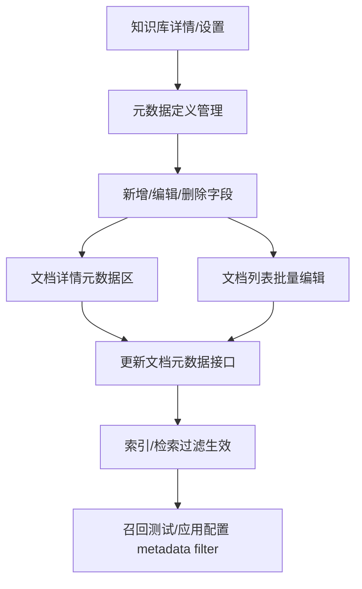

# PRD：知识库新增元数据

状态：评审中草稿（已有底层接口线索，但缺完整 schema、检索过滤接口、正式原型截图，不能标“已批准”）

版本：v0.2
更新日期：2026-07-10
负责人：PM 待确认
关联项目总脑：`../00_项目总脑.md`

## 0. 文档信息

| 项 | 内容 |
|---|---|
| 需求名称 | 知识库新增元数据 |
| 需求 ID | KB-META |
| 当前阶段 | 竞品调研 + PRD 草稿 + 接口补齐 |
| 证据索引 | `../02_竞品调研/evidence/evidence-index.md` |
| 接口索引 | `../06_接口/接口清单.md` |
| 原型状态 | 正式 Pencil 原型未开始 |
| 评审状态 | 等产品/后端/前端/QA/检索负责人评审 |

## 1. 背景与问题

底层已有元数据能力，但控制台未暴露。管理员无法在页面上定义、查看或修改文档的自定义原始信息，应用配置人员也无法稳定地用元数据做检索过滤。

典型场景：

- 文档需要记录来源 URL、部门、发布日期、文档类型等原始信息；
- 检索时需要先按这些信息缩小候选文档/切片，再做语义召回；
- 客户希望按自己的 key 管理文档信息，而不是只能依赖文件名或上传时间。

## 2. 目标、非目标与成功指标

### 2.1 目标

| ID | 目标 | 衡量方式 |
|---|---|---|
| META-G-001 | 管理员能在控制台管理元数据定义 | 可查看、新增、编辑、删除字段定义 |
| META-G-002 | 管理员能给文档填写或修改元数据值 | 支持文档详情单个编辑和文档列表批量编辑 |
| META-G-003 | 应用/召回测试能配置元数据过滤条件 | 检索请求能携带 metadata filter 并影响候选文档 |
| META-G-004 | 前后端字段与底层接口一致 | 字段映射表覆盖请求、响应、错误和边界 |

### 2.2 非目标

- 不把元数据与标签合并。
- 不用元数据直接替代权限系统或计费系统。
- 不在未确认接口前自定义字段类型、错误码或检索表达式。
- 本期不做自动抽取/智能推荐，除非后端或竞品证据证明已有低成本能力。

### 2.3 成功指标（待基线）

- 管理员可在控台完成元数据定义和赋值，不依赖手工 API 调用。
- 元数据更新后在约定时间内影响检索过滤。
- 批量更新失败时，用户能知道哪些文档失败以及失败原因。
- 删除字段定义或字段值前，影响范围清晰可见。

## 3. 用户、角色与场景

| 角色 | 场景 | 权限要求 |
|---|---|---|
| 知识库管理员 | 管理元数据字段定义，如 `source_url`、`department` | 知识库管理权限 |
| 文档维护人员 | 在文档详情或批量操作中填写元数据值 | 文档编辑权限 |
| 应用配置人员 | 在应用/召回测试里配置 metadata filter | 应用配置权限和知识库可见权限 |
| 普通检索用户 | 发起检索，系统按配置好的元数据条件过滤 | 不直接编辑元数据 |
| 后端/QA | 验证接口字段、错误码、过滤语义和生效时间 | 测试环境权限 |

## 4. 范围与优先级

| 优先级 | 范围 | 说明 |
|---|---|---|
| P0 | 元数据定义列表、新增、编辑、删除 | 字段层级、类型、名称规则待接口确认 |
| P0 | 文档详情查看/编辑元数据值 | 单文档入口必须可用 |
| P0 | 文档列表批量编辑元数据值 | 支持多文档赋值、清空、失败明细 |
| P0 | 检索/召回测试中配置元数据过滤 | 明确 filter 表达式和生效链路 |
| P0 | 接口字段映射、错误反馈、权限 | 依赖 Apifox 完整 schema |
| P1 | 内置字段开关、使用量、引用关系、删除影响详情 | 正式竞品待采；Dify built-in/custom 仅作参考实现 |
| P1 | 导入/导出、批量清空、模板化元数据 | 依赖 P0 稳定 |
| P2 | 自动抽取、正则/LLM 生成元数据 | 阿里云百炼元数据提取可作为正式竞品参考 |

## 5. 信息架构与主流程

### 5.1 定义管理流程

1. 管理员进入知识库详情或设置页的“元数据”入口。
2. 页面展示当前字段定义：字段名、类型、使用文档数、是否内置、更新时间。
3. 管理员新增字段，选择类型并填写名称。
4. 编辑字段时，若类型不允许修改，只允许改名；若字段已被引用，展示影响范围。
5. 删除字段定义前，提示该字段及所有文档值的影响范围。

### 5.2 文档赋值流程

1. 管理员进入文档详情，查看当前文档元数据值。
2. 点击编辑后，可新增字段值、修改值、清空值或移除该文档上的字段。
3. 文档列表多选后，可进入批量元数据编辑器。
4. 批量编辑需明确：只更新已有字段、应用到全部选中文档、清空值、部分失败策略。

### 5.3 检索过滤流程

1. 应用配置人员在召回测试或应用知识库节点中添加元数据过滤条件。
2. 选择字段、运算符和值。
3. 系统按条件过滤候选文档/切片，再执行召回。
4. 测试结果显示过滤条件、候选数量变化和命中文档元数据。

## 6. 功能需求

| ID | 需求 | 优先级 | 行为 | 异常/边界 | 验收 |
|---|---|---|---|---|---|
| META-REQ-001 | 查看元数据定义列表 | P0 | 展示字段名、类型、使用文档数、是否内置、创建/更新时间 | 无字段显示空态；无权限只读 | AC-META-001 |
| META-REQ-002 | 新增元数据定义 | P0 | 填写字段名、选择类型后保存 | 重名、非法名称、类型缺失、超限阻断 | AC-META-002 |
| META-REQ-003 | 编辑元数据定义 | P0 | 支持改名；类型是否可改待接口确认 | 被使用字段改名需提示影响；类型不可改时禁用 | AC-META-003 |
| META-REQ-004 | 删除元数据定义 | P0 | 删除前展示影响范围，确认后删除字段和相关值 | 被检索配置引用时需阻断或提示迁移 | AC-META-004 |
| META-REQ-005 | 文档详情查看/编辑元数据 | P0 | 展示当前文档值；编辑后保存到后端 | 值类型不匹配、文档不存在、无权限 | AC-META-005 |
| META-REQ-006 | 文档列表批量编辑元数据 | P0 | 多选文档后批量添加/更新/清空字段值 | 部分失败需失败清单；覆盖/部分更新语义待确认 | AC-META-006 |
| META-REQ-007 | 元数据检索过滤 | P0 | 召回测试/应用配置可添加 metadata filter | 运算符、AND/OR、空值语义待接口确认 | AC-META-007 |
| META-REQ-008 | 内置字段展示与开关 | P1 | 展示来源 URL、文件名等系统字段，可配置是否启用 | 内置字段值只读或由系统生成 | AC-META-008 |
| META-REQ-009 | 审计与生效状态 | P1 | 展示最近更新时间、更新人、检索生效状态 | 索引延迟、失败、并发冲突 | AC-META-009 |

## 7. 交互截图表

正式截图需来自后续 Pencil/HTML 验证；当前先给出区域、状态与交互要求。

| 区域/状态截图 | 页面或区域说明 | 显示逻辑 | 操作与交互逻辑 | 异常/边界 | 证据或原型来源 |
|---|---|---|---|---|---|
| `STATE-META-DEFINITION-LIST.png` | 知识库元数据定义列表 | 展示字段名、类型、使用文档数、内置/自定义、更新时间 | 搜索、创建、编辑、删除、查看引用 | 空态、无权限、加载失败 | 正式竞品待控制台补证；参考 META-EV-0006/0007/0008 |
| `STATE-META-CREATE.png` | 新增元数据字段弹窗/抽屉 | 字段名、字段类型、说明（如需要） | 选择类型、输入名称、保存/取消 | 重名、非法字符、类型缺失 | 火山/阿里控制台待采；我方接口待确认 |
| `STATE-META-EDIT.png` | 编辑元数据字段 | 已有字段名回填；类型是否锁定 | 改名保存；查看影响范围 | 类型不可改、被检索配置引用、并发修改 | 火山创建后标签名不可变更可作风险参考 |
| `STATE-META-DELETE.png` | 删除定义确认 | 展示使用文档数、引用配置、删除后影响 | 二次确认删除 | 被引用阻断、删除失败、无权限 | 我方待接口确认 |
| `STATE-META-DOC-DETAIL.png` | 文档详情元数据区 | 展示当前文档字段和值；空态显示添加入口 | 进入编辑、添加字段、改值、清空、保存 | 值类型错误、文档索引中、无权限 | 参考 META-EV-0005 |
| `STATE-META-BATCH.png` | 文档列表批量元数据编辑器 | 多选文档后展示字段和值编辑区 | 添加已有字段/新字段、应用范围、保存 | 部分失败、覆盖/部分更新、清空值 | 火山/阿里控制台待采；内部接口待确认 |
| `STATE-META-RETRIEVAL.png` | 召回测试/应用配置 metadata filter | 展示字段、运算符、值、组合关系 | 添加/删除条件，测试召回，查看过滤结果 | 字段被删、值类型不匹配、无命中文档 | 参考阿里 SearchFilters / PAI MetaDataFilterConditions、火山 doc_filter；我方接口待确认 |
| `STATE-META-ERROR.png` | 接口错误反馈 | 表单级 + 字段级错误展示 | 保留用户输入，支持重试 | 401/403/404/400/批量部分失败 | 待接口错误码确认 |

## 8. 接口与数据

### 8.1 已验证我方接口线索

| 能力 | 方法/路径 | 状态 |
|---|---|---|
| 新增元数据 | Apifox `/473610411e0` | 路径/字段待提取 |
| 更新元数据 | Apifox `/473619166e0` | 路径/字段待提取 |
| 删除元数据 | Apifox `/473629415e0` | 路径/字段待提取 |
| 查询元数据 | Apifox `/473713180e0` | 路径/响应待提取 |
| 更新文档元数据 | `POST /knowledge/openapi/v2/datasets/{dataset_id}/documents/metadata` | 已提取主要结构 |

更新文档元数据已知结构：

- 路径参数：`dataset_id`，UUID，必填。
- 请求体：`operation_data[]`。
- 单项：`operation_data[].document_id`。
- 元数据列表：`operation_data[].metadata_list[]`，示例含 `id/name/value`。
- 已见响应：`200`（无响应体）、`400`、`401`、`403`、`404`。

### 8.2 待确认接口语义

| 问题 | 影响 |
|---|---|
| 元数据定义层级是知识库级 schema 还是文档临时 key | 决定字段列表和文档编辑器行为 |
| `id/name/value` 的必填性、类型、空值语义 | 决定表单校验和清空行为 |
| 是否支持 `partial_update` 或覆盖更新 | 决定批量编辑器“只更新已有字段/应用到全部” |
| 批量更新是全量事务还是部分成功 | 决定失败清单和回滚 |
| 检索接口 metadata filter 的表达式 | 决定应用配置和 QA 用例 |

## 9. 异常与边界

| 场景 | 预期处理 |
|---|---|
| 字段重名 | 阻断保存，错误定位到字段名 |
| 类型不可改 | 编辑页禁用类型选择并说明原因 |
| 删除字段定义 | 提示全局影响；若被检索配置引用需阻断或要求迁移 |
| 删除某文档字段值 | 只影响当前文档或选中文档，不删除字段定义 |
| 批量部分失败 | 展示失败文档、字段、原因；成功项是否保留以接口约定为准 |
| 值类型不匹配 | 字段级错误，不提交或提交后回显错误 |
| 检索字段被删除 | 召回测试/应用配置标红失效条件，要求重新选择 |
| 元数据更新未生效 | 显示生效中/失败/最后更新时间，召回测试给出提示 |
| 无权限 | 只读或隐藏编辑入口，接口 403 明确提示 |

## 10. 验收标准

| ID | 对应需求 | 验收描述 |
|---|---|---|
| AC-META-001 | META-REQ-001 | 给定管理员进入元数据页，则能看到字段定义列表、空态或加载错误 |
| AC-META-002 | META-REQ-002 | 给定合法字段名和类型，当保存新增字段，则字段出现在列表和文档编辑器 |
| AC-META-003 | META-REQ-003 | 给定字段已被文档使用，当改名保存，则文档详情和列表同步展示新名称 |
| AC-META-004 | META-REQ-004 | 给定字段被文档或检索配置引用，当删除时，系统展示影响并按规则阻断/确认 |
| AC-META-005 | META-REQ-005 | 给定文档详情编辑元数据值，当保存成功并刷新，值仍正确展示 |
| AC-META-006 | META-REQ-006 | 给定批量更新多文档，当部分失败，则用户能看到失败文档和原因 |
| AC-META-007 | META-REQ-007 | 给定检索配置 `department=finance`，当召回测试执行，则不符合条件的文档切片不进入候选集 |
| AC-META-008 | META-REQ-008 | 给定启用内置字段，当查看文档元数据，则系统字段按只读/自动生成规则展示 |
| AC-META-009 | META-REQ-009 | 给定元数据更新后索引未完成，当立即测试召回，则页面显示生效状态或延迟提示 |

## 11. 指标与发布

| 指标 | 说明 |
|---|---|
| 元数据字段创建成功率 | 监控定义管理稳定性 |
| 文档元数据更新成功率 | 区分单文档/批量 |
| 批量部分失败比例 | 用于优化失败清单和重试 |
| metadata filter 使用次数 | 观察功能被应用配置采纳情况 |
| 过滤前后候选文档数量 | 验证过滤是否真实生效 |

发布建议：

1. 先开放只读定义列表和文档详情展示。
2. 再开放单文档编辑和批量编辑。
3. 最后开放应用/召回测试 metadata filter，并监控检索质量和性能。

## 12. 决策与待确认

| ID | 状态 | 问题/决策 | 负责人 | 影响 |
|---|---|---|---|---|
| META-DEC-001 | CONFIRMED | 元数据作为独立需求，不与标签合并 | 用户 | PRD、接口、验收独立 |
| META-Q-001 | TO_CONFIRM | 元数据定义是知识库级 schema 还是文档临时 key | 产品+后端 | 阻塞定义管理 |
| META-Q-002 | TO_CONFIRM | 支持哪些值类型、名称规则、数量和长度限制 | 后端 | 阻塞表单校验 |
| META-Q-003 | TO_CONFIRM | 批量更新是否支持部分更新、覆盖、清空和部分成功 | 后端+QA | 阻塞批量交互 |
| META-Q-004 | TO_CONFIRM | 检索 API 的 metadata filter 表达式和运算符 | 后端/检索 | 阻塞过滤验收 |
| META-Q-005 | TO_CONFIRM | 内置字段是否存在、是否可开关、是否只读 | 产品+后端 | 阻塞 P1 范围 |

## 13. 评审记录

详见 `评审记录.md`。当前版本可进入产品/研发初评，不能作为最终开发闭环。
