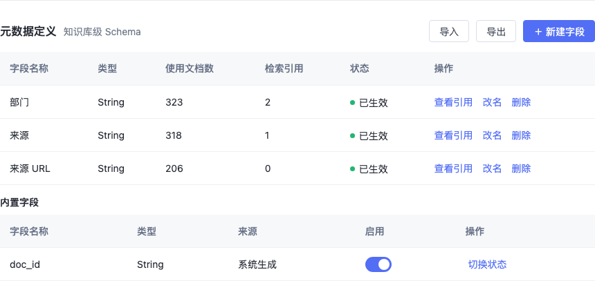
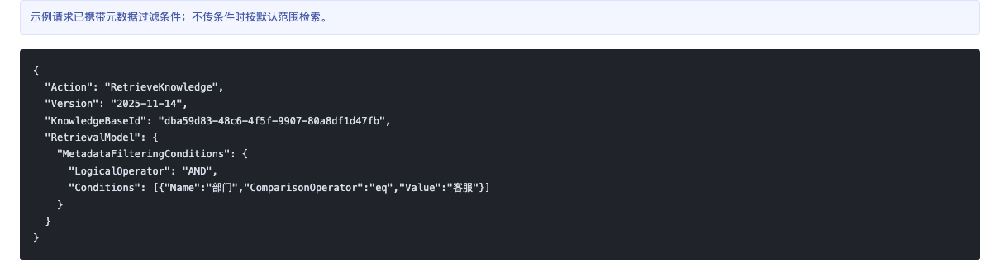
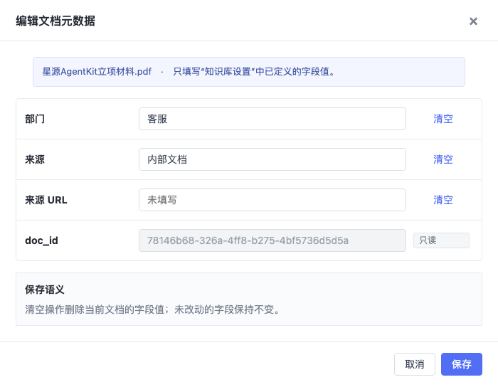
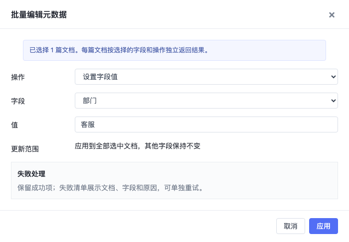

# 5. 产品原型与交互流程

## 5.0 页面改动总览

| 现有页面 | 新增内容 | 当前原型图 |
| --- | --- | --- |
| 知识库设置 | 在现有设置页底部新增“元数据定义”区域，支持查看字段名称、类型、使用文档数、检索引用、状态及操作；不新增一级导航。 |  |
| 文档信息 | 在现有文档列表中新增“元数据摘要”列，并提供单文档编辑入口和多选后的批量编辑入口。 |  |
| 知识库检索 | 在召回测试区新增元数据条件组，支持配置字段、运算符、值及条件关系，并展示过滤前后候选数量。 |  |
| 示例代码 | 在现有示例请求中展示元数据过滤参数；未传过滤条件时保持原有检索行为。 |  |

说明：新建知识库页和导入文档页均保持现状。元数据定义在知识库创建完成后维护，文档元数据值在文档导入完成后维护。

## 5.1 元数据定义入口与查看流程

| 交互名称 | 局部原型截图 | 详细交互逻辑 |
| --- | --- | --- |
| 进入元数据定义 |  | 管理员先按现有流程创建知识库。创建完成后进入知识库详情，点击【知识库设置】页签；页面沿用现有设置布局，不增加新的一级菜单，也不要求在创建知识库时预定义元数据。 |
| 查看元数据定义列表 |  | 系统展示当前知识库可用的元数据定义。自定义字段展示字段名称、类型、使用文档数、检索引用、状态和操作；内置字段单独展示来源和启用状态。字段 ID 仅用于接口和内部关联，不在列表中暴露。使用文档数与检索引用用于判断改名、删除时的影响范围。 |

## 5.2 元数据定义管理流程

| 交互名称 | 局部原型截图 | 详细交互逻辑 |
| --- | --- | --- |
| 点击【＋ 新建字段】 |  | 点击【＋ 新建字段】后打开弹窗。管理员填写字段名称并选择后端支持的字段类型；P0 仅开放 String。字段名称必填，长度为 1 至 40 个字符，同一知识库内不可重名。点击【确定】后创建字段并刷新列表；创建失败时保留已填写内容并展示明确原因。字段创建后类型不可修改。 |
| 点击【改名】 |  | 点击字段行的【改名】后回填当前名称、字段类型和使用情况。仅允许修改字段名称，字段类型锁定；保存前执行必填、长度和重名校验。保存成功后刷新定义列表和相关展示，字段 ID 与已有文档值保持不变。 |
| 点击【删除】 |  | 点击【删除】后先查询并展示字段影响范围，包括已赋值文档数和检索配置引用数。存在检索引用时阻断删除，并提示先迁移或移除引用；允许删除时必须二次确认。删除成功后移除字段定义及其文档值，并刷新检索索引。 |
| 切换内置字段状态 |  | 内置字段与自定义字段分区展示。管理员点击开关启用或停用内置字段；停用前检查检索引用并提示影响范围。系统生成字段只读，不允许改名、改类型或手工赋值。 |

## 5.3 文档赋值流程

| 交互名称 | 局部原型截图 | 详细交互逻辑 |
| --- | --- | --- |
| 查看文档元数据摘要 |  | 文档导入完成后，管理员进入【文档信息】。列表在现有字段基础上新增“元数据摘要”列，优先展示有值的自定义字段；字段较多时仅展示摘要，完整内容在编辑抽屉中查看。导入文档页不新增元数据输入项。 |
| 点击【编辑元数据】 |  | 点击文档行的【编辑元数据】后，从右侧打开编辑抽屉。抽屉只展示“知识库设置”中已定义的字段；管理员可填写、修改或清空自定义字段值。内置字段显示为只读。保存采用部分更新语义：只更新本次改动字段，未改动字段保持不变；清空表示删除当前文档的该字段值。保存成功后更新列表摘要并触发相关检索索引刷新。 |
| 多选文档后点击【批量编辑元数据】 |  | 勾选一个或多个文档后显示批量操作栏，并启用【批量编辑元数据】。操作范围严格限定为当前选中文档；取消全部选择后批量操作栏隐藏，按钮恢复禁用状态。 |
| 设置批量更新规则并点击【应用】 |  | 批量编辑支持“设置字段值”和“清空字段值”两类操作。管理员选择字段并填写目标值后点击【应用】，系统仅更新指定字段，其他字段保持不变。每篇文档独立返回结果；成功项立即生效，失败项进入明细清单，展示文档、字段和失败原因并支持单独重试。 |

## 5.4 检索过滤流程

| 交互名称 | 局部原型截图 | 详细交互逻辑 |
| --- | --- | --- |
| 点击【筛选】并配置条件 |  | 应用配置人员在召回测试或应用知识库节点中点击【筛选】，展开元数据条件区。每条条件依次选择字段、运算符和值；字段候选来自当前知识库已启用的元数据定义，运算符按字段类型提供。条件关系位于右侧，支持“且（AND）”和“或（OR）”。 |
| 点击【＋ 添加条件】 |  | 点击【＋ 添加条件】后在当前条件组追加一行。删除条件时至少保留一行空条件；未填写完整的条件不得提交，并在对应字段处提示。AND 表示全部条件同时满足，OR 表示任一条件满足。 |
| 点击检索按钮执行召回 |  | 提交检索后，系统先按元数据条件过滤候选文档或切片，再执行向量、倒排和 Rerank 召回。结果区展示过滤前候选数、过滤后候选数、命中切片数，并在命中文档下展示本次参与过滤的元数据。未配置元数据条件时沿用原检索链路。 |
