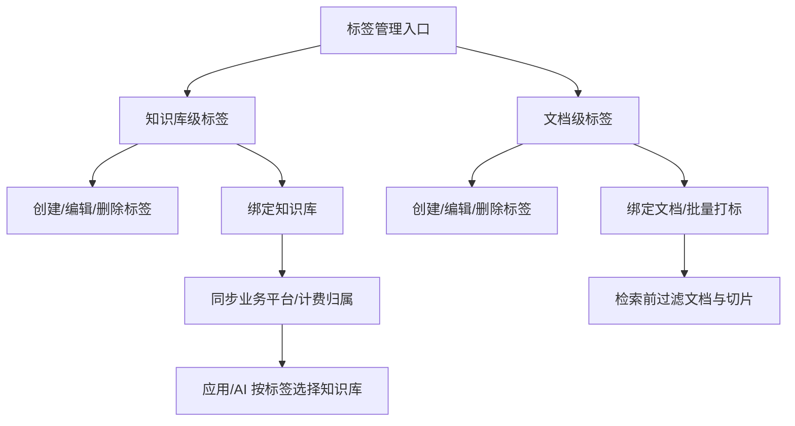

# PRD：知识库新增标签

状态：评审中草稿（缺我方标签接口、计费归属模型、控制台截图和 Pencil 原型确认，不能标“已批准”）

版本：v0.2
更新日期：2026-07-10
负责人：PM 待确认
关联项目总脑：`../00_项目总脑.md`

## 0. 文档信息

| 项 | 内容 |
|---|---|
| 需求名称 | 知识库新增标签 |
| 需求 ID | KB-TAG |
| 当前阶段 | 竞品调研 + PRD 草稿 |
| 证据索引 | `../02_竞品调研/evidence/evidence-index.md` |
| 接口索引 | `../06_接口/接口清单.md` |
| 原型状态 | Pencil MCP 已跑通；正式标签原型未开始 |
| 评审状态 | 等产品/业务平台/后端/前端/QA 评审 |

## 1. 背景与问题

一个账号下可能存在多个业务知识库；同一知识库内也可能混有财务、销售、研发等不同使用范围的文档。当前缺少稳定标签信号，导致：

- AI 应用难以在多个知识库中先选择正确检索对象；
- 知识库的项目、部门、成本中心等计费归属缺少可配置入口；
- 检索时无法在文档/切片进入召回前，基于业务标签做过滤。

本需求必须明确分为两类标签：

| 对象 | 作用 | 是否涉及计费 | 管理边界 |
|---|---|---|---|
| 知识库级标签 | 给知识库分类，用于应用/AI 路由、项目/业务归属和计费对接 | 是 | 需与业务/应用平台明确主数据、同步和计费归属 |
| 文档级标签 | 给文档分类，用于检索前过滤文档及切片 | 否 | 知识库侧管理，和权限系统分层 |

## 2. 目标、非目标与成功指标

### 2.1 目标

| ID | 目标 | 衡量方式 |
|---|---|---|
| TAG-G-001 | 管理员能分别管理知识库级标签和文档级标签 | 控台入口、列表、创建、编辑、删除、绑定链路可用 |
| TAG-G-002 | 应用/AI 能按知识库级标签选择候选知识库 | 检索/应用配置中可按标签过滤知识库，接口有明确表达 |
| TAG-G-003 | 文档级标签能在检索前过滤文档/切片 | 不符合标签条件的文档切片不进入召回候选集 |
| TAG-G-004 | 知识库级标签能承载计费归属 | 业务平台/计费系统能识别项目/部门/成本中心等归属 |

### 2.2 非目标

- 不用标签替代完整 RBAC/ABAC 权限系统。
- 不把文档级标签纳入计费。
- 不把元数据需求合并到标签需求；二者可共享过滤链路，但产品对象独立。
- 未确认接口前，不写死后端字段名、错误码或路径。

### 2.3 成功指标（待基线）

- 标签变更后，在约定生效时间内影响检索候选集。
- 知识库级标签与计费归属无冲突、无孤儿同步状态。
- 标签删除/改名不会造成不可解释的检索或计费结果。
- 管理员可追踪某标签影响哪些知识库、文档和应用。

## 3. 用户、角色与场景

| 角色 | 场景 | 权限要求 |
|---|---|---|
| 平台管理员 | 创建知识库级标签，绑定知识库到项目/部门/成本中心 | 需要业务平台或租户级权限 |
| 知识库管理员 | 给文档设置文档级标签，批量调整文档标签 | 需要知识库管理权限 |
| 应用配置人员 | 在应用/工作流里按知识库级标签选择知识库范围 | 需要应用配置权限和知识库可见权限 |
| 普通检索用户 | 发起检索时只能命中符合角色/标签条件的文档切片 | 不直接编辑标签 |
| 计费/运营人员 | 查看知识库级标签对应的业务归属和计费影响 | 需要计费或运营权限 |

## 4. 范围与优先级

| 优先级 | 范围 | 说明 |
|---|---|---|
| P0 | 知识库级标签 CRUD、绑定/解绑、列表筛选、计费归属字段/同步状态 | 计费归属模型待业务平台确认 |
| P0 | 文档级标签 CRUD、文档绑定/解绑、批量打标、检索过滤表达 | 不涉及计费 |
| P0 | 操作权限、删除影响提示、基础错误反馈、审计字段 | 字段以接口为准 |
| P1 | 标签使用量、引用对象列表、导入/导出、批量跨库操作 | 依赖 P0 数据模型 |
| P1 | 应用编排中按标签动态选择知识库 | 依赖应用平台入口 |
| P2 | 标签推荐、自动打标、标签治理报表 | 本期不作为上线阻塞 |

## 5. 信息架构与主流程

### 5.1 知识库级标签主流程

1. 管理员进入知识库标签管理。
2. 创建标签并选择业务归属类型（项目/部门/成本中心等，`TO_CONFIRM`）。
3. 绑定一个或多个知识库。
4. 系统同步业务/应用平台，并返回同步状态。
5. 应用配置或 AI 路由按知识库级标签选择检索范围。

### 5.2 文档级标签主流程

1. 知识库管理员进入文档列表或文档详情。
2. 选择单个或多个文档并设置标签。
3. 保存后系统更新文档标签索引。
4. 检索请求携带文档级标签条件。
5. 系统先过滤候选文档/切片，再执行召回。

## 6. 功能需求

### 6.1 知识库级标签

| ID | 需求 | 优先级 | 行为 | 异常/边界 | 验收 |
|---|---|---|---|---|---|
| TAG-KB-001 | 查看知识库级标签列表 | P0 | 展示名称、绑定知识库数、业务归属、同步状态、更新时间 | 无标签显示空态；无权限隐藏编辑操作 | AC-TAG-001 |
| TAG-KB-002 | 创建知识库级标签 | P0 | 输入名称，选择/填写业务归属信息；保存后进入列表 | 重名、超长、非法字符、业务归属缺失需阻断 | AC-TAG-002 |
| TAG-KB-003 | 编辑知识库级标签 | P0 | 支持修改名称和业务归属；展示影响范围 | 计费已生效标签修改需二次确认；同步失败可重试 | AC-TAG-003 |
| TAG-KB-004 | 删除知识库级标签 | P0 | 删除前展示绑定知识库、应用引用、计费影响 | 被计费/应用引用时按规则阻断或要求解除引用 | AC-TAG-004 |
| TAG-KB-005 | 绑定/解绑知识库 | P0 | 一个知识库可绑定多个知识库级标签；支持批量 | 部分成功需明确回滚/保留策略 | AC-TAG-005 |
| TAG-KB-006 | 按标签筛选知识库 | P0 | 控制台、应用配置或检索路由可按标签选知识库 | 标签不存在、无权限、同步未完成需有提示 | AC-TAG-006 |
| TAG-KB-007 | 计费归属同步 | P0 | 标签变更触发业务平台/计费归属更新 | 同步失败、延迟、生效时间需可见 | AC-TAG-007 |

### 6.2 文档级标签

| ID | 需求 | 优先级 | 行为 | 异常/边界 | 验收 |
|---|---|---|---|---|---|
| TAG-DOC-001 | 查看文档级标签列表 | P0 | 展示名称、绑定文档数、创建人、更新时间 | 无标签显示空态 | AC-TAG-101 |
| TAG-DOC-002 | 创建/编辑文档级标签 | P0 | 知识库管理员创建标签，供文档绑定使用 | 重名、超长、非法字符需阻断 | AC-TAG-102 |
| TAG-DOC-003 | 单文档打标 | P0 | 文档详情可新增/移除标签，保存后反馈成功 | 文档不存在、索引中、无权限需提示 | AC-TAG-103 |
| TAG-DOC-004 | 批量文档打标 | P0 | 文档列表多选后添加/移除标签 | 部分文档失败需展示失败清单 | AC-TAG-104 |
| TAG-DOC-005 | 检索前标签过滤 | P0 | 检索请求可携带文档级标签条件，先过滤文档/切片 | AND/OR、包含/排除、多标签组合待接口确认 | AC-TAG-105 |
| TAG-DOC-006 | 权限边界 | P0 | 标签可作为过滤条件，但不替代权限系统最终鉴权 | 无权限用户不能通过标签绕过文档权限 | AC-TAG-106 |

## 7. 交互截图表

正式截图需来自后续 Pencil/HTML 验证；当前先给出区域、状态与交互要求。

| 区域/状态截图 | 页面或区域说明 | 显示逻辑 | 操作与交互逻辑 | 异常/边界 | 证据或原型来源 |
|---|---|---|---|---|---|
| `STATE-TAG-KB-LIST.png` | 知识库级标签列表 | 有标签时显示名称、绑定知识库数、业务归属、计费同步状态；无标签显示创建引导 | 支持搜索、筛选、创建、编辑、删除、查看引用 | 无权限隐藏操作；同步失败显示重试；删除前展示影响 | TO_CONFIRM：Pencil 正式原型 |
| `STATE-TAG-KB-CREATE.png` | 创建知识库级标签弹窗/抽屉 | 默认空表单；业务归属字段待业务平台确认 | 输入名称、选择归属、保存/取消；保存中禁用重复提交 | 重名、非法字符、归属缺失、同步失败 | TO_CONFIRM：接口与业务平台 |
| `STATE-TAG-KB-BIND.png` | 给知识库绑定标签 | 展示已绑标签和可选标签；可搜索 | 多选标签后保存；保存成功刷新列表和绑定数 | 部分失败、标签被删除、知识库无权限 | 参考 TAG-EV-0003；我方待原型 |
| `STATE-TAG-KB-BILLING.png` | 计费归属提示区 | 仅知识库级标签显示；文档级标签不显示 | 展示项目/部门/成本中心、同步状态、最近失败原因 | 业务平台不可用、计费归属冲突、待同步 | TO_CONFIRM：业务平台方案 |
| `STATE-TAG-DOC-LIST.png` | 文档级标签管理列表 | 展示名称、绑定文档数、更新时间 | 新建、编辑、删除、查看关联文档 | 被文档引用删除需提示；不出现计费字段 | TO_CONFIRM：Pencil 正式原型 |
| `STATE-TAG-DOC-BATCH.png` | 文档列表批量打标 | 多选文档后出现批量设置标签入口 | 添加/移除标签，提交后显示成功/失败清单 | 部分文档无权限、索引中、已删除 | TO_CONFIRM：控制台现状 |
| `STATE-TAG-DOC-DETAIL.png` | 文档详情标签区 | 展示当前文档标签，可编辑 | 添加已有标签或新建标签后绑定；保存/取消 | 空态、无权限、标签被并发删除 | TO_CONFIRM：Pencil 正式原型 |
| `STATE-TAG-RETRIEVAL.png` | 检索/应用配置过滤条件 | 文档级标签作为过滤条件；知识库级标签作为知识库范围条件 | 选择标签、配置 AND/OR、保存配置，测试召回结果 | 条件为空、标签不存在、无可见知识库/文档 | TO_CONFIRM：检索接口 |

## 8. 接口与数据

### 8.1 已有证据

- 我方：当前可见 Apifox 目录未发现标签接口，状态 `TO_CONFIRM`。
- 对标：Dify 官方文档提供知识库级标签 API，包括创建、列表、更新、绑定、解绑。

### 8.2 我方需要的接口能力

| 对象 | 能力 | 状态 | 说明 |
|---|---|---|---|
| 知识库级标签 | CRUD | TO_CONFIRM | 需补业务归属、计费同步状态、审计 |
| 知识库级标签 | 绑定/解绑知识库 | TO_CONFIRM | 需支持多标签、多知识库、部分失败策略 |
| 知识库级标签 | 应用/检索按标签选库 | TO_CONFIRM | 明确发生在应用平台、检索层还是路由层 |
| 文档级标签 | CRUD | TO_CONFIRM | 不含计费字段 |
| 文档级标签 | 绑定/解绑文档 | TO_CONFIRM | 需支持批量、失败明细、索引生效 |
| 检索 | 文档级标签过滤表达式 | TO_CONFIRM | 明确 AND/OR、包含/排除、空值语义 |

## 9. 异常与边界

| 场景 | 预期处理 |
|---|---|
| 标签重名 | 阻断保存，错误定位到名称字段 |
| 标签被引用时删除 | 展示引用范围；知识库级还需展示应用/计费影响 |
| 业务平台同步失败 | 保存状态明确；允许重试或回滚，需有审计 |
| 文档级标签过滤与权限冲突 | 权限优先；标签过滤不能扩大可见范围 |
| 标签变更后索引未生效 | 展示“生效中/失败/最近更新时间”，检索测试给出解释 |
| 批量打标部分失败 | 保留成功项并展示失败清单，或按接口约定全量回滚 |
| 并发编辑 | 保存时校验版本或最后更新时间，冲突需提示刷新 |

## 10. 验收标准

| ID | 对应需求 | 验收描述 |
|---|---|---|
| AC-TAG-001 | TAG-KB-001 | 给定管理员有权限，当进入知识库级标签列表，则能看到标签、绑定数、业务归属和同步状态 |
| AC-TAG-002 | TAG-KB-002 | 给定名称合法且业务归属完整，当创建标签，则保存成功并可绑定知识库 |
| AC-TAG-003 | TAG-KB-003 | 给定标签已被知识库引用，当编辑名称或业务归属，则系统展示影响并记录审计 |
| AC-TAG-004 | TAG-KB-004 | 给定标签关联应用或计费对象，当删除时，系统按规则阻断或要求解除引用 |
| AC-TAG-005 | TAG-KB-005 | 给定多知识库和多标签，当批量绑定，则成功项与失败项可追踪 |
| AC-TAG-006 | TAG-KB-006 | 给定应用配置按标签选库，当测试检索，则只进入符合知识库级标签的知识库范围 |
| AC-TAG-007 | TAG-KB-007 | 给定标签业务归属变更，当保存成功，则业务平台同步状态最终可见 |
| AC-TAG-101 | TAG-DOC-001 | 给定知识库管理员进入文档级标签列表，则能看到标签和绑定文档数，不出现计费信息 |
| AC-TAG-102 | TAG-DOC-002 | 给定合法名称，当创建文档级标签，则可在文档详情和批量打标中选择 |
| AC-TAG-103 | TAG-DOC-003 | 给定单文档打标成功，当刷新文档详情，则标签仍存在并进入过滤索引 |
| AC-TAG-104 | TAG-DOC-004 | 给定批量打标部分失败，当保存完成，则展示失败文档及原因 |
| AC-TAG-105 | TAG-DOC-005 | 给定检索条件包含文档级标签，当召回执行，则不符合条件的文档切片不进入候选集 |
| AC-TAG-106 | TAG-DOC-006 | 给定用户无某文档权限，即使标签条件命中，该文档切片也不得返回 |

## 11. 指标与发布

| 指标 | 说明 |
|---|---|
| 标签创建成功率 | 区分知识库级/文档级 |
| 标签绑定成功率 | 区分单个/批量、成功/部分失败 |
| 计费同步失败数 | 仅知识库级标签 |
| 标签过滤检索命中变化 | 记录过滤前后候选文档/切片数量 |
| 删除/改名失败原因分布 | 用于优化引用提示和操作流程 |

发布建议：

1. 灰度给内部测试租户。
2. 先开放文档级标签过滤和知识库级标签展示，再开放计费同步。
3. 计费链路必须有回滚和审计后再进入正式商用。

## 12. 决策与待确认

| ID | 状态 | 问题/决策 | 负责人 | 影响 |
|---|---|---|---|---|
| TAG-DEC-001 | CONFIRMED | 知识库级标签与文档级标签分开写 | 用户 | PRD、接口、验收双轨 |
| TAG-DEC-002 | CONFIRMED | 只有知识库级标签涉及计费 | 用户 | 文档级标签不得出现计费字段 |
| TAG-Q-001 | TO_CONFIRM | 知识库级标签计费归属模型是什么 | 产品+业务平台 | 阻塞知识库级标签 P0 定稿 |
| TAG-Q-002 | TO_CONFIRM | 文档级标签与权限系统责任边界 | 产品+后端 | 阻塞检索/鉴权验收 |
| TAG-Q-003 | TO_CONFIRM | 我方标签接口是否已有、字段和限额是什么 | 后端 | 阻塞接口和前端实现 |
| TAG-Q-004 | TO_CONFIRM | 标签变更对检索索引的生效时间 | 后端 | 阻塞异常和验收 |

## 13. 评审记录

详见 `评审记录.md`。当前版本可进入内部初评，但不能作为研发最终排期依据。
