# 5. 产品原型与交互流程

## 5.0 页面改动总览

| 现有页面 | 新增内容 | 当前原型图 |
| --- | --- | --- |
| 新建知识库 | 保留名称、描述、所属项目、规格与费用栏；在“所属项目”后增加可选的知识库标签，不在创建页定义文档标签。 |  |
| 导入文档 | 保留数据源、上传文件、解析方式、分段设置和底部操作栏；在上传文件后增加文档标签，并应用到本次上传的全部文档。 |  |
| 知识库列表与基本信息 | 支持展示、筛选、编辑和批量维护知识库标签，同时保留所属项目。 | 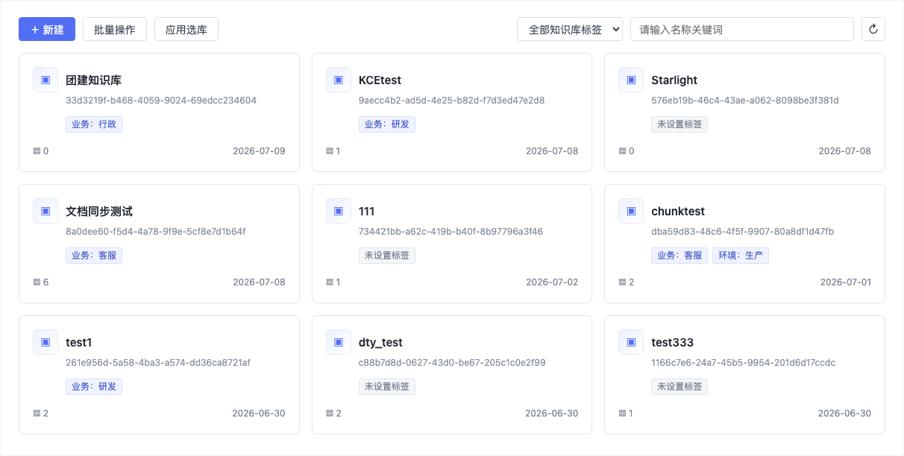 |
| 知识库设置 | 在现有设置页底部新增“文档标签”区域，统一维护可复用的字符串标签，不新增一级导航。 | 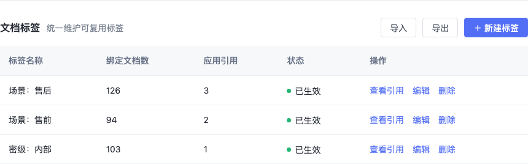 |
| 文档信息 | 新增文档标签列、单文档编辑入口和多选后的批量设置入口。 | 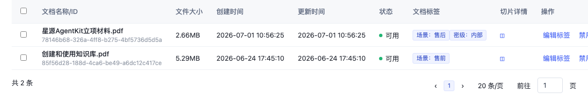 |
| 知识库检索 | 新增文档标签条件组，支持 AND 或 OR 组合，并展示过滤后的召回结果。 | 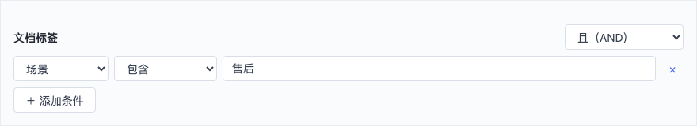 |
| 示例代码 | 展示文档标签过滤参数；未传过滤条件时保持原有检索行为。 | 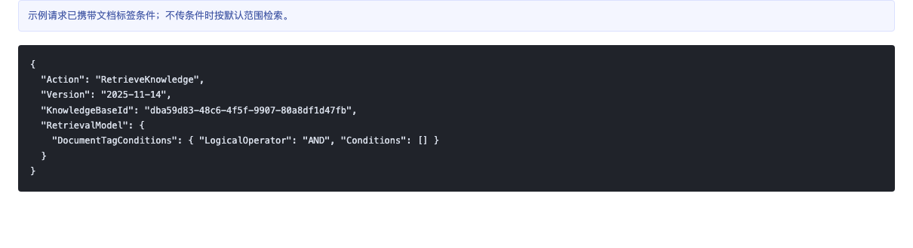 |

## 5.1 知识库级标签主流程

| 交互名称 | 局部原型截图 | 详细交互逻辑 |
| --- | --- | --- |
| 新建知识库时选择标签 |  | 管理员在现有“新建知识库”页填写基础信息，并可在“所属项目”后选填已有知识库标签。标签用于知识库分类、应用选库和计费归属；不填标签不阻断创建。点击【立即购买】后仍按现有创建逻辑提交，不自动跳转导入文档页。 |
| 在知识库列表筛选标签 |  | 知识库卡片展示已绑定标签；无标签时展示“未设置标签”。列表右侧提供知识库标签筛选，可选择具体标签或“未设置标签”，并与名称关键词组合过滤。刷新列表时保留当前筛选条件。 |
| 在基本信息中查看标签 |  | 进入知识库详情后，在现有“基本信息”区域展示知识库标签、编辑入口和同步状态。标签与“所属项目”分别展示，避免替代或混淆现有项目归属字段。 |
| 点击【编辑】维护知识库标签 | 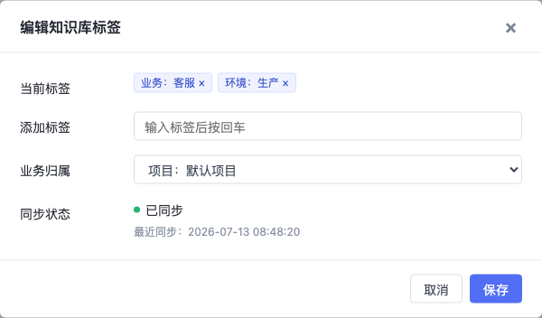 | 点击知识库标签后的【编辑】打开弹窗，可移除当前标签、添加已有标签并设置业务归属。保存后更新当前知识库标签并触发业务或应用平台同步；页面展示最近同步状态。同步失败不回滚标签保存结果，但必须给出失败原因和重试入口。 |
| 点击【批量操作】 | 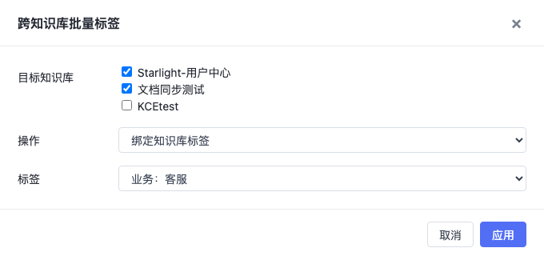 | 在知识库列表点击【批量操作】后打开右侧抽屉。管理员选择目标知识库、绑定或解除操作及目标标签，再点击【应用】。系统仅处理所选知识库，逐项返回成功或失败结果；失败项可重试，未选择知识库不受影响。 |
| 点击【应用选库】 | 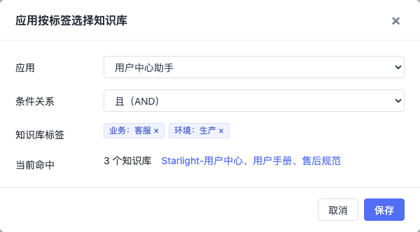 | 应用配置人员点击【应用选库】，选择应用并配置知识库标签条件。支持“且（AND）”和“或（OR）”；页面实时展示当前命中的知识库数量和名称。保存后应用或 AI 路由按该条件动态选择检索范围。 |

## 5.2 文档级标签主流程

| 交互名称 | 局部原型截图 | 详细交互逻辑 |
| --- | --- | --- |
| 导入文档时选择文档标签 |  | 业务开发人员在现有“导入文档”页上传文件后，可选填一个或多个已有文档标签。所选标签应用到本次上传的全部文档；不填标签不阻断导入。文档标签只放在导入文档页，不放在知识库创建页。 |
| 在知识库设置中查看标签定义 |  | 管理员进入【知识库设置】后，在页面底部查看当前知识库可复用的文档标签。列表展示标签名称、绑定文档数、应用引用、状态及操作。查看引用用于评估编辑或删除对文档和检索配置的影响。 |
| 点击【＋ 新建标签】 | 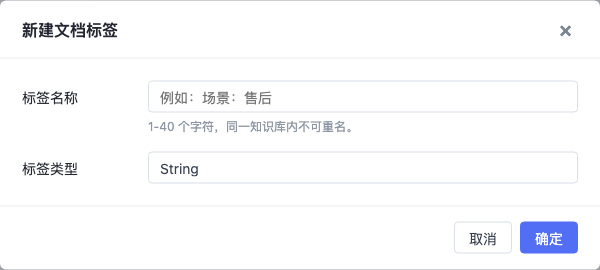 | 点击【＋ 新建标签】后输入标签名称。P0 仅支持 String 标签；名称必填，长度为 1 至 40 个字符，同一知识库内不可重名。创建成功后刷新标签定义列表，创建失败时保留输入并展示原因。 |
| 点击【编辑标签】 | 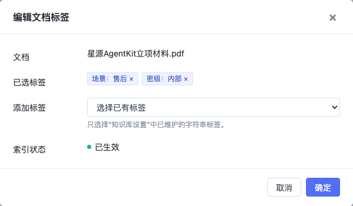 | 在【文档信息】中点击单篇文档的【编辑标签】，打开编辑弹窗。只能选择“知识库设置”中已维护的标签；可添加或移除多个标签。保存后更新文档标签列并触发标签检索索引刷新，未修改标签保持不变。 |
| 多选文档后点击【批量设置标签】 |  | 勾选一个或多个文档后显示批量操作栏，并启用【批量设置标签】。批量操作范围严格限定为当前选中文档；取消全部选择后操作栏隐藏。 |
| 设置批量标签并点击【应用】 | 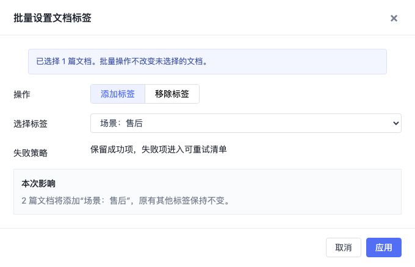 | 批量设置支持“添加标签”和“移除标签”。添加时保留文档原有其他标签；移除时只移除指定标签。系统逐篇返回结果，成功项立即生效，失败项进入可重试清单并展示失败原因。 |
| 点击【筛选】配置文档标签条件 |  | 在召回测试或应用知识库节点中点击【筛选】，展开文档标签条件组。每条条件选择标签分类、运算符和值；条件关系位于右侧，支持 AND 或 OR。点击【＋ 添加条件】可追加条件，未填写完整的条件不得提交。 |
| 点击检索按钮验证过滤结果 |  | 系统先按文档标签过滤候选文档或切片，再执行召回。结果区展示过滤前候选数、过滤后候选数和命中切片数，并在命中文档下展示标签。未配置标签条件时沿用原检索链路。 |
